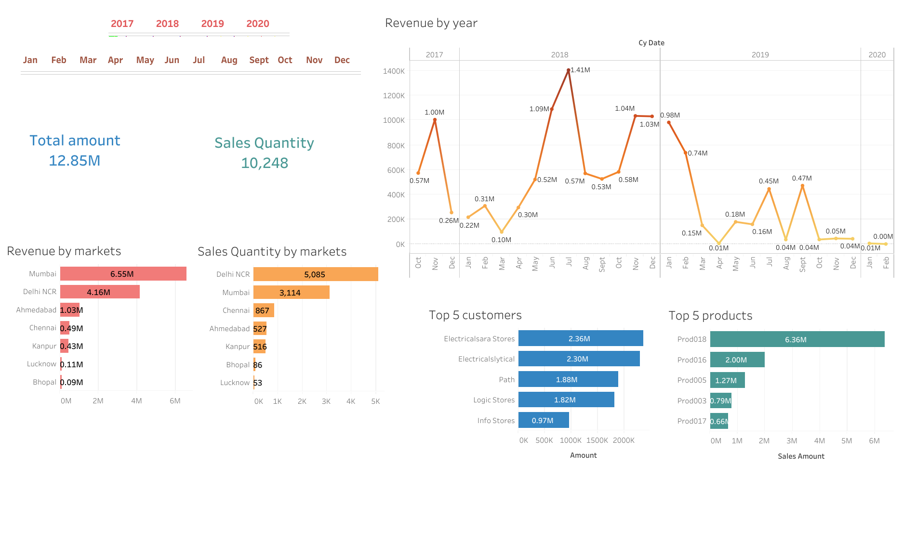
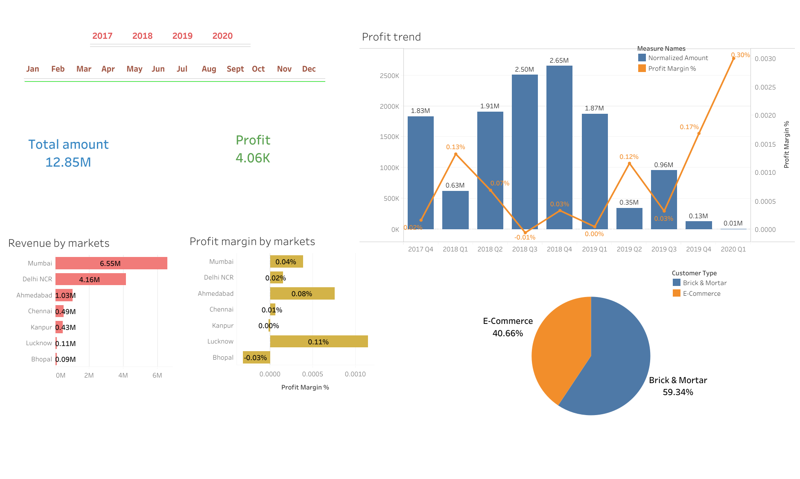

# Sales-Insights-Dashboard
Sales Insights - Data Analysis using Tableau &amp; SQL

- Developed Revenue Analysis and Profit Analysis dashboards for a hardware company (AtliQ Hardware).
- Included metrics like total revenue, quantity, trends, market-specific insights, and top customers/products.
- Implemented SQL for efficient database management, ensuring seamless integration with Tableau.
- Conducted in-depth data analysis for revenue trends and profitability indicators.
- Utilized for delivering clear visual insights to organization, aiding in informed decision-making by staying updated on real-time revenue, profit trends, and market-specific data.

# Tableau Dashboards 

## 1. [Revenue Analysis](https://public.tableau.com/views/SalesInsights-Revenueanalysis/Dashboard1-revenueanalysis?:language=en-US&:sid=&:display_count=n&:origin=viz_share_link)

## 2. [Profit Analysis](https://public.tableau.com/views/SalesInsights-Profitanalysis/Dashboard2-profitanalysis?:language=en-US&:sid=&:display_count=n&:origin=viz_share_link)

